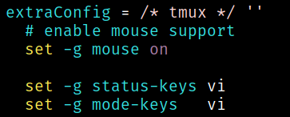

# \*Kim's personal NixOS configs

Now with 100% more flake!

This repository is home to the nix code that builds my systems.

- _Allows unfree packages `nixpkgs.config.allowUnfree = true`_
- Uses [digga][]
- Makes use of [Home Manager][] to manage dotfiles
- Compatible with [Nix-Darwin][] (probably; haven't used it in a while)
- Uses [Nixvim][] to handle [Neovim configuration](users/profiles/nixvim)
- ~~Fenced syntax highlighting via a [modified version of vim-nix][vim-nix]~~
  - Has some injections with [nvim-treesitter][], which does not currently
    support dynamic language injection with comment prefixes

[home manager]: https://github.com/rycee/home-manager
[nix-darwin]: https://github.com/LnL7/nix-darwin
[vim-nix]: https://github.com/rummik/vim-nix/tree/language-fencing
[digga]: https://github.com/divnix/digga
[nixvim]: https://github.com/pta2002/nixvim/
[nvim-treesitter]: https://github.com/nvim-treesitter/nvim-treesitter

<!--
## Layout

- `config/` - Package configurations
  - `config/home-manager` - [Home Manager](https://github.com/rycee/home-manager) configurations
- `hosts/` - Host specific configurations
- `modules/` - Custom modules
- `overlays/` - Package overlays
- `profiles/` - Configuration profiles
-->

## Install ISO

```sh
# Insert a USB drive
just bootstrap
```

## Searching

- Packages
  - `nix search -u`
  - `nix search <packagename>`
- Files
  - `nix-index`
  - `nix-locate <pattern>`
  - `nix-locate -r <regex>`
  - `nix-locate -w <whole file name>`

## Debugging

Run `nix repl '<nixpkgs/nixos>'`, configuration results are under `config.*`,
reload with `:r`

Or use `nixos-option` to determine the current and default values for an option,
and view the option's description

Alternatively use `nix repl '<darwin>'`, or `darwin-option` if using nix-darwin

### Fenced syntax highlighting



## Why Nix?

Nix allows for easy to manage, collaborative, reproducible deployments. This means that once something is setup and configured once, it works forever. If someone else shares their configuration, anyone can make use of it.

This flake is configured with the use of [digga][].
